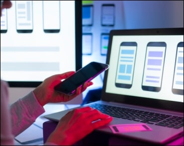

# goit-markup-hw-01.
Мой первый репозиторий
<!DOCTYPE html>
<html lang="en">
<head>
    <meta charset="UTF-8">
    <meta name="viewport" content="width=device-width, initial-scale=1.0">
    <title>hw1</title>
</head>
<header>
<nav>
<a href="">WebStudio</a>
<ul>
    <li><a href="">Студия</a></li>
    <li><a href="">Портфолио</a></li>
    <li><a href="">Контакты</a></li>
</ul>
</nav>
<ul>
    <li><a href="tel:">+38 096 111 11 11</a></li>
    <li><a href="mailto:">info@devstudio.com</a></li>
</ul>
</header>
 <body>
    <main>
    <section>
        <h1>Эффективные решения для вашего бизнеса</h1>
        <button type="button">Заказать услугу</button>
    </section>
    <section>
        <ul>
            <li>
                <h3>Внимание к деталям</h3>                
                
Идейные соображения, а также начало повседневной работы по формированию позиции.

            </li>
            <li>
                <h3>Пунктуальность</h3>    
                
Задача организации, в особенности же рамки и место обучения кадров влечет за собой.

            </li>
            <li>
                <h3>Планирование</h3>
                
Равным образом консультация с широким активом в значительной степени обуславливает.

            </li>
            <li>
                <h3>Современные технологии</h3>            
                
Значимость этих проблем настолько очевидна, что реализация плановых заданий.

            </li>
        </ul>
    
    </section>
    <section>
        <h3>Чем мы занимаемся</h3>
        <ul>
        <li></li>
        <li></li>
        <li></li>
        </ul>
        
        
    </section>
    <section>
        <h4>Наша команда</h4>
        <ul>
        <li></li>
        <li></li>
        <li></li>
        <li></li>            
        </ul>
    </section>
    <footer>
        <a href="">WebStudio</a>
        <ul>        
         <li>
            
г.Киев, пр-т Леси Украинки,26

         </li>
         <li><a href="tel:">info@devstudio.com</a></li>
         <li><a href="mailto:">+38 096 111 11 11</a></li>
        </ul>

    </footer> 
    </main>
 </body>
</html>
